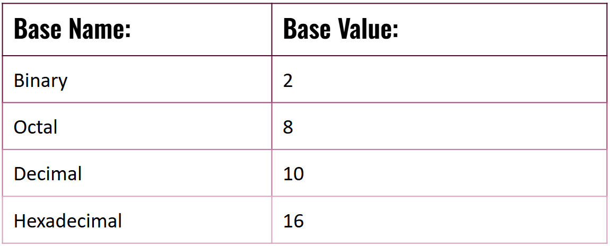

# The Hexorcist Base Converter!

This code runs a base converting calculator! It uses all bases (2-36). The converter narrator is snarky, so don't get offended if you see random sarcastic/mean messages. That just means the hexorcist converter is doing it's job (it's the only one that exists, so **NO** we can't fire it.)

🔮🧙🟰😠🫠💻🔮🧙🟰😠🫠💻🔮🧙🟰😠🫠💻🔮🧙🟰😠🫠💻

## You might be wondering, how do you use this base converter?

Below is a detailed step-by-step walkthrough of how to use the hexorcist code.
  

### First, how to run the program:

1. Save/copy the code. 
2. Create a new file (name it something simple that represents the code like hexorcist.py).
3. Open your program/terminal and open the file you created.
4. Press the play icon (▶️) to run the script in the terminal!
 

##  How to run the base converter after opening the program:

1. 👋 | The code will present you with a welcome message! It will than give you a quick reminder about the 4 common types of bases, and the base range. Here is a photo example of the 4 common bases:

2. 🧮 | The code will than ask you what your value is. Enter any value you wish, then press enter.

3. ❔ | After inputting your number, the code will ask you for your numbers **current** base. This should be the base (2-16) that your number is in. Input any number between 2 and 16, then press enter.  

4. ❔ | The code will than ask what you what base (2-16) you would like to convert your number to. In other words, this is your **target** base. Input any number between 2 and 16, then press enter. 

5. 🎉 | After steps 1-4 he code will tell you you base converted number! Woohoo! 

6. 🔄 | The code than asks you if you would like to convert another number. If you would like to convert another number, input "y", then press enter. If you do **NOT** want to convert another number, input "n" and then press enter.

7. ‼️**THIS STEP ONLY APPLIES IF YOU ENTERED "Y" ON THE PREVIOUS STEP**‼️. Yay, You want to convert another number! Repeat steps 1 - 6 and enjoy!

## Test cases
### Below is instructions on how the test cases run!

##### There are 5 sections of test casing within this base converter. The test cases test the 4 most common bases: binary(2), octal(8), decimal(10), and hex(16).
 
1. **Binary Section:** This section tests binary converted to 3 common bases (octal, decimal, and hex). For instance, the binary value "1010", is equal to the decimal value "10". 
2. **Octal Section:** This section tests octal converted to 3 common bases (binary, decimal, and hex). For instance, the octal value "12", is equal to the binary value "1010"
3. **Decimal Section:**  This section tests decimal converted to 3 common bases (binary, octal, and hex). For instance, the decimal value of "10", is equal to the octal value "12". 
4. **Hex Section:** This section tests hex converted to 3 common bases (binary, octal, and decimal). For instance, the hex value "C7", is equal to the binary value "11000111".
5. **Testing Zeros:** This is the final section. This section tests each base, convertedto it's same base. For instance, the hex value "C7" will equal the hex value "C7". 
